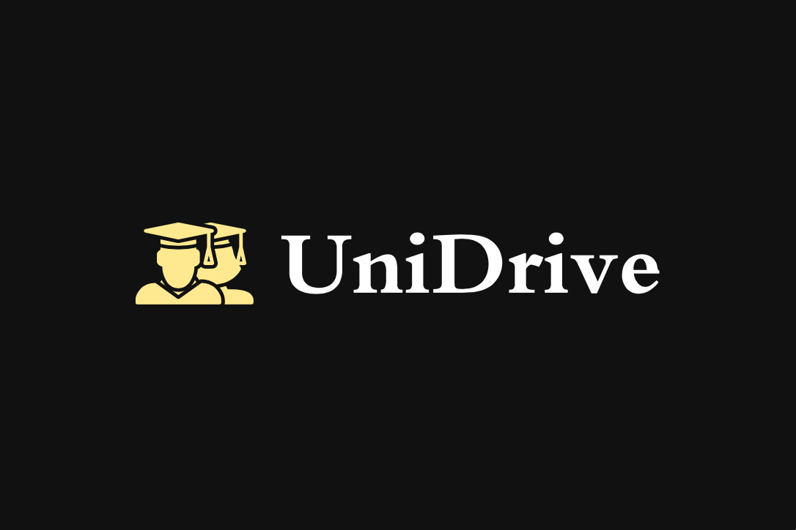

<!-- PROJECT SHIELDS -->
<!--
*** I'm using markdown "reference style" links for readability.
*** Reference links are enclosed in brackets [ ] instead of parentheses ( ).
*** See the bottom of this document for the declaration of the reference variables
*** for contributors-url, forks-url, etc. This is an optional, concise syntax you may use.
*** https://www.markdownguide.org/basic-syntax/#reference-style-links
-->
[![Contributors][contributors-shield]][contributors-url]
[![Forks][forks-shield]][forks-url]
[![Stargazers][stars-shield]][stars-url]
[![Issues][issues-shield]][issues-url]
[![MIT License][license-shield]][license-url]
[![LinkedIn][linkedin-shield]][linkedin-url]

<!-- PROJECT LOGO -->
 

  

  

<!-- TABLE OF CONTENTS -->

  
Table of Contents

  <ol>
    <li>
      <a href="#about-the-project">About The Project</a>
      <ul>
        <li><a href="#built-with">Built With</a></li>
      </ul>
    </li>
    <li>
      <a href="#demo">Demo</a>
    </li>
    <li><a href="#usage">Usage</a></li>
    <li><a href="#roadmap">Roadmap</a></li>
    <li><a href="#license">License</a></li>
    <li><a href="#contact">Contact</a></li>
  </ol>

<!-- ABOUT THE PROJECT -->
## About The Project

Share part of the whole journey to the University with other students thanks to UniDrive!

It's a carpooling application that allows users to search for a ride, to book for a ride and to make informed decisions about drivers.

Save time, money, and be safe!

(<a href="#readme-top">back to top</a>)

### Built With

* [![Go][Go-badge]][Go-url]
* [![Flutter][Flutter-badge]][Flutter-url]
* [![SQLite][SQLite-badge]][SQLite-url]
* [![Swagger][Swagger-badge]][Swagger-url]
* [![Figma][Figma-badge]][Figma-url]

(<a href="#readme-top">back to top</a>)

<!-- Demo -->
### Demo

Here you can see a demo of the app:

https://github.com/Alessandro-vecchi/UniDrive/assets/76568209/ff82d962-85ae-47e8-894b-05128f3786dc

(<a href="#readme-top">back to top</a>)

<!-- USAGE EXAMPLES -->
## Usage

API Documentation in doc/api.yaml.

To run the back-end:

- Open a terminal
- Run `go run main.go`

To run the front-end:

- Connect an android phone in debug mode or use an emulator
- Select the device
- Open a terminal and write `flutter run` in the `front-end-flutter` folder
- Make sure the Flutter SDK path is right and the Dart plugin is inserted

(<a href="#readme-top">back to top</a>)

<!-- ROADMAP -->
## Roadmap

- [x] Add Badges
- [x] Add back to top links
- [x] Add Video
- [x] Add License 
- [x] Add Contact
- [ ] Add Usage
- [ ] Add Getting Started
- [ ] Add Changelog
      
<!-- LICENSE -->
## License

Distributed under the MIT License. See `LICENSE.txt` for more information.

(<a href="#readme-top">back to top</a>)

<!-- CONTACT -->
## Contact

Alessandro Vecchi - alessandro.vecchi66@gmail.com

Project Link: [https://github.com/Alessandro-vecchi/UniDrive](https://github.com/Alessandro-vecchi/UniDrive)

(<a href="#readme-top">back to top</a>)

<!-- MARKDOWN LINKS & IMAGES -->
<!-- https://www.markdownguide.org/basic-syntax/#reference-style-links -->
[contributors-shield]: https://img.shields.io/github/contributors/Alessandro-vecchi/UniDrive.svg?style=for-the-badge
[contributors-url]: https://github.com/Alessandro-vecchi/UniDrive/graphs/contributors

[forks-shield]: https://img.shields.io/github/forks/Alessandro-vecchi/UniDrive.svg?style=for-the-badge
[forks-url]: https://github.com/Alessandro-vecchi/UniDrive/network/members

[stars-shield]: https://img.shields.io/github/stars/Alessandro-vecchi/UniDrive.svg?style=for-the-badge
[stars-url]: https://github.com/Alessandro-vecchi/UniDrive/stargazers

[issues-shield]: https://img.shields.io/github/issues/Alessandro-vecchi/UniDrive.svg?style=for-the-badge
[issues-url]: https://github.com/Alessandro-vecchi/UniDrive/issues

[license-shield]: https://img.shields.io/github/license/Alessandro-vecchi/UniDrive.svg?style=for-the-badge
[license-url]: https://github.com/Alessandro-vecchi/UniDrive/blob/master/LICENSE.txt

[linkedin-shield]: https://img.shields.io/badge/-LinkedIn-black.svg?style=for-the-badge&logo=linkedin&colorB=555
[linkedin-url]: https://linkedin.com/in/alessandro-v-6711

[product-screenshot]: images/screenshot.png
[Flutter-badge]: https://img.shields.io/badge/Flutter-%2302569B.svg?style=for-the-badge&logo=Flutter&logoColor=white
[Flutter-url]: https://flutter.dev/

[Go-badge]: https://img.shields.io/badge/go-%2300ADD8.svg?style=for-the-badge&logo=go&logoColor=white
[Go-url]: https://go.dev/

[Go-badge]: https://img.shields.io/badge/go-%2300ADD8.svg?style=for-the-badge&logo=go&logoColor=white
[Go-url]: https://go.dev/

[Figma-badge]: https://img.shields.io/badge/figma-%23F24E1E.svg?style=for-the-badge&logo=figma&logoColor=white
[Figma-url]: https://figma.com/

[SQLite-badge]: https://img.shields.io/badge/sqlite-%2307405e.svg?style=for-the-badge&logo=sqlite&logoColor=white
[SQLite-url]: https://sqlite.org/

[Swagger-badge]: https://img.shields.io/badge/-Swagger-%23Clojure?style=for-the-badge&logo=swagger&logoColor=white
[Swagger-url]: https://swagger.io/
